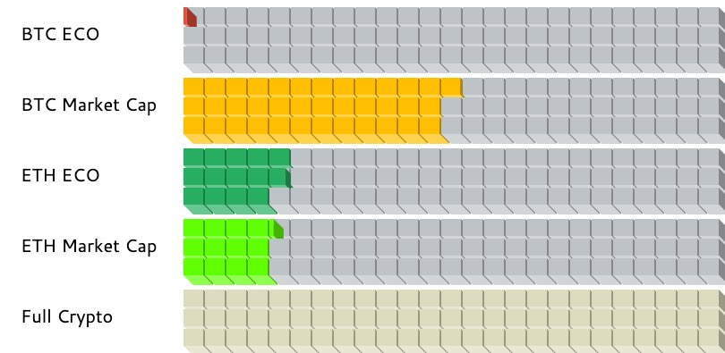

# Whitepaper for ConSync Ecosystem Project

## The Evolution of the Bitcoin Ecosystem
The Bitcoin ecosystem has evolved significantly since its inception in 2009. This evolution has been marked by the entrance of miners, the emergence of trading platforms, the Lightning Network, RGB, STX, and other innovations. These developments have progressively increased Bitcoin's adoption for payments and raised its profile. However, the real turning point in the ecosystem came with the advent of Ordinals and BRC-20, which reinvigorated the Bitcoin environment with a culture of active building and innovation.

### The Rise of Ordinals
The launch of the NFT protocol "Ordinals" in December 2022 by software engineer Casey Rodarmor, and its subsequent upgrade in January 2023, introduced NFTs to the Bitcoin network without changing the underlying protocol. This innovation allowed for native Bitcoin NFTs, compatible with the network and not reliant on secondary layers, marking a significant step forward for the Bitcoin ecosystem.

### Key Players and Innovations
The Bitcoin ecosystem has seen significant backing from major players, including exchanges like OKX, which has become deeply involved in the development of the ecosystem's infrastructure. Their support extends from wallet tools and browsers to trading markets and even protocol standards, making them a pivotal figure in Bitcoin's technological growth.

### BRC-20 and its Derivatives
The creation of the experimental BRC-20 token standard by Twitter user @domodata in March 2023 was another milestone. This standard, inspired by Ordinals, introduced a new wave of BRC-20 tokens, followed by innovative derivatives like ORC-20 and BRC-20 S. These developments provided enhanced functionality and opened new opportunities for the Bitcoin ecosystem.

### Market Needs and Developer Influx
With the market's demand for new narratives and Bitcoin's halving event on the horizon, the ecosystem's development has become increasingly crucial. The growth of the Bitcoin ecosystem can bring substantial transaction fees, supporting miners and maintaining network security. This aligns with Satoshi Nakamoto's original vision for Bitcoin.

The influx of developers into the Bitcoin ecosystem, driven by market prospects and wealth effects, has been a notable trend. From Ordinals to BTC Layer 2, a growing number of developers, including those from other blockchain ecosystems like Solana and BSV, have been contributing to Bitcoin's technical advancement.

### Long-term Value and Challenges
As the Bitcoin ecosystem continues to evolve, its long-term value and potential cannot be overstated.  
With its strong consensus base, substantial capital accumulation, and market demands, Bitcoin's ecosystem stands at the precipice of a new era of innovation and growth.  
In summary, the Bitcoin ecosystem, with its historical richness and burgeoning innovations, holds immense potential for the future. 
 As it embarks on an uncharted path of exploration and growth, the ecosystem is poised to reshape the narrative of Bitcoin, moving beyond its storied past as a mere store of value. This journey into the unknown holds great promise, deserving encouragement and support from the broader crypto community.  

So far, the Bitcoin ecosystem has grown from scratch to more than 600 million U.S. dollars this year, but it still has huge space compared with the Ethereum ecosystem.

### The Emergence of Atomicals Protocol within ConSync
The introduction of the Atomicals Protocol within the ConSync project marks a watershed moment in the evolution of the Bitcoin ecosystem. Atomicals Protocol brings the concept of digital objects to life on Bitcoin and other proof-of-work blockchains, similar to non-fungible tokens (NFTs) on platforms like Ethereum.

### Breakthrough Features of Atomicals Protocol
- Digital Objects Beyond Currency: Atomicals allow for the creation, transfer, and update of unique digital objects, expanding Bitcoin’s utility beyond just a currency.
- Cultural Shift and Innovation: The Atomicals Protocol reinvigorated the Bitcoin ecosystem with a renewed focus on building and actualizing practical applications.
- Peer-to-Peer Exchange and Digital Identity: The protocol facilitates decentralized trading and introduces new dimensions of digital identity and token-gated content on the Bitcoin blockchain.
### Why Atomicals Represent a Major Breakthrough
- Enabling NFTs on Bitcoin: Atomicals bring native NFT capabilities to Bitcoin, operating within the existing protocol without reliance on secondary layers, thus expanding Bitcoin's capabilities significantly.

- Empowering the Bitcoin Ecosystem: By introducing dynamic digital objects, Atomicals transform Bitcoin from a mere transactional currency to a platform for a wide array of digital assets and applications.

- Sparking Developer Interest and Innovation: The Atomicals Protocol has rekindled interest among developers and creators in the Bitcoin ecosystem, leading to a surge in innovative applications and use cases.

- Aligning with Current Market Trends: As the market evolves, there is a growing demand for more complex and diverse blockchain applications. Atomicals Protocol aligns Bitcoin with these trends, positioning it as a more versatile and multifunctional blockchain.

## Introduction

ConSync is an ambitious project designed to enhance the Bitcoin (BTC) ecosystem by integrating the novel Atomicals Protocol. Our goal is to create the largest ecosystem on the Bitcoin blockchain, powered by the innovative capabilities of Atomicals. This whitepaper outlines our vision, the framework for our ecosystem, and the roadmap to achieve our objectives.

### Introduction to Atomicals Protocol

Atomicals Protocol is an advanced protocol designed to bring to life digital objects on Bitcoin and other proof-of-work blockchains. It's a groundbreaking approach to minting, transferring, and updating digital objects (akin to non-fungible tokens, NFTs) on UTXO blockchains like Bitcoin. The protocol is defined by its simplicity and flexibility, offering a new paradigm for digital ownership without the need for third-party services or indexers.

#### Key Features:

- **Digital Collectibles, Media, and Art**: Atomicals enable the creation and transfer of unique digital assets.
- **Digital Identity and Token-Gated Content**: Utilize Atomicals for secure digital identity verification and access control.
- **Peer-to-Peer Exchange and Atomic Swaps**: Facilitate decentralized trading and swaps directly on the Bitcoin blockchain.
- **Digital Namespace Allocation**: Allocate and manage digital names and identities with ease.
- **Virtual Land and Title Registries**: Use Atomicals for managing virtual properties in the metaverse.
- **Dynamic Objects for Gaming and Social Media**: Create and manage dynamic digital objects for games and social platforms.

## The ConSync Ecosystem

The ConSync ecosystem is designed to be a comprehensive suite of services and infrastructure for the Atomicals Protocol, enhancing its utility and accessibility. Our offerings include:

### Infrastructure Development

The initial phase focuses on strengthening the foundational elements of the ConSync ecosystem:

- **Node Services and Data Indexing**: Ensuring robust support for network nodes and efficient Atomicals data indexing.
    - In development, en route.
- **Blockchain Explorer**: Developing a tool compatible with the Atomicals Protocol for on-chain data exploration.
    - In development, launching imminently.
- **Indexer and CLI Program Enhancement**: Improving existing tools for better integration and interaction with the Atomicals Protocol.
    - In development, en route.

### DeFi Systems and NFT Passports

Concurrent with infrastructure development, we will deploy:

- **DeFi Platforms**: Introduce decentralized exchanges (DEX), cross-chain functionalities, stablecoins, liquidity provisions, and yield aggregation.
  - DEX: [Doc ref](https://docs.atomicals.xyz/arc20-tokens/swap-transfer-rules)
    - In development, en route.
    - We use the atomic swap rules of the Atomic protocol here to trade any token.
     > An Atomical Swap can take place between any ARC20, NFT or regular Satoshis.  
  For example, the following direct transfers are possible, it is up to the seller to define how they would like to receive payment and in what other Atomical token type (if any) 
    Possible direct swaps: 
    ARC20  <--> Satoshis 
    ARC20  <--> ARC20 
    ARC20  <--> NFT 
    NFT       <--> Satoshis 
    NFT       <--> NFT 
    NFT       <--> ARC20 

   - Stablecoins, introducing Ethereum ecosystem liquidity, PoS (Proof of Stake) rewards and U.S. Treasury yields, permissionless access to migrate Ethereum ecosystem liquidity.
   - The Consync ecosystem is set to introduce an **ecological token** (XXX, to be determined), which will serve as the central medium for value storage and transfer in DeFi activities on the Bitcoin network.
    - Consider an order book DEX, utilizing Partially Signed Bitcoin Transactions (PSBTs) as the foundation for trading pairs. The ecosystem token entitles holders to a share of DEX revenues, guiding liquidity into the platform. This structure acts as a carrier for stablecoin liquidity, distributing profits from Ethereum or other PoS ecosystems, including yields from government bonds.
### DID and DNS
Expanding the applications of DID and DNS with the core feature of Atomicals Protocol, the Realm Name System (RNS), we aim to extend the realm domain system.  
This will involve developing a suite of infrastructure to promote the realm as a Web3 identity system based on Bitcoin, and decentralizing DNS services to innovate further the underlying layers of the current Web2 network.

### Launchpad

After establishing a robust infrastructure and DeFi systems, ConSync will introduce:

- **Launchpad Platform**: A dedicated platform designed to support new projects within the ecosystem, offering grants, IDO systems, and developmental assistance in a **fair** and equitable manner.

## Vision and Mission

ConSync aims to establish the Bitcoin blockchain as the ultimate source of digital sovereignty and authenticity. By leveraging the Atomicals Protocol, we envision creating a decentralized and secure digital environment where ownership and authenticity are indisputable.

## Roadmap and Future Development

ConSync is committed to revolutionizing the Bitcoin blockchain, leveraging the innovative Atomicals Protocol. 
Our vision is to construct a decentralized ecosystem that features a user-friendly Realm Name System, advanced DeFi platforms, NFT passports, and a nurturing launchpad.  
This positions ConSync as a leader in blockchain innovation. 
Our one-year roadmap is meticulously planned to prioritize the development of foundational infrastructure services.  
This phased approach ensures steady progress, laying the groundwork for a decentralized and self-sovereign digital future.  
Our methodical expansion will see these core components intricately woven into the fabric of the ecosystem, step by step, leading us towards reshaping the landscape of digital interactions and ownership on the Bitcoin blockchain.

## Economic Model for ConSync Ecosystem
The ConSync ecosystem, underpinned by the Atomicals Protocol, introduces a novel economic model centered around its native ARC20 token. This model is designed to promote fairness, accessibility, and active participation within the ecosystem. The key features of this model are as follows:

### Fair and Accessible Token Distribution
#### Minting Mechanism
- Token Minting: Every individual can mint ARC20 tokens, ensuring equal opportunity for participation.
- Minting Cost: The only cost associated with minting is the transaction fee, making the process accessible to a wide user base.
- Token Cap: A fixed cap on the total supply of ARC20 tokens to maintain scarcity and value.
### Distribution Philosophy
- Equitable Access: Ensuring that every participant has an equal opportunity to mint tokens, thereby democratizing access to the ecosystem’s resources.
- Incentivizing Participation: Encouraging active ecosystem engagement by linking token accessibility to contributions and interactions within the ConSync ecosystem.

### Fee Structure
#### Usage Fees
- Minimal Fees: Transaction fees are kept minimal to encourage active participation and usage of ARC20 tokens within the ecosystem.
Fee Allocation: A portion of the transaction fees is allocated to ecosystem development and maintenance.
### Incentives for Node Operators
- Fee Redistribution: A percentage of transaction fees is distributed to Atomicals protocol node operators as an incentive for maintaining Atomicals accessibility.
### DeFi Integration
#### Staking and Rewards
- Staking Mechanism: ARC20 token holders can stake their tokens to participate in network governance and earn rewards.
- Reward Distribution: Rewards are distributed based on the staked amount and duration, promoting long-term holding and stability.
#### Liquidity Provision
- Liquidity Pools: Creation of liquidity pools within the ConSync DeFi platforms to facilitate token swaps and other DeFi activities.
- Incentives for Liquidity Providers: Offering rewards to users who provide liquidity, thus ensuring adequate liquidity within the ecosystem.
### Governance and Voting Rights
#### Decentralized Governance
- Token-based Voting: ARC20 token holders have voting rights in the governance of the ConSync ecosystem, aligning with decentralized governance principles.
- Proposal and Voting System: Implementing a system where token holders can propose changes or vote on key decisions, ensuring community-led development.
### Ecosystem Expansion and Token Burn
#### Token Burn Mechanism
- Periodic Token Burns: Implementing a mechanism to burn a portion of the tokens, potentially from transaction fees, to reduce the overall supply and increase scarcity over time.
#### Ecosystem Growth
- Reinvestment in Ecosystem: A portion of the transaction fees is reinvested into the ecosystem for continuous development, marketing, and community building activities.
### Economic Sustainability
#### Long-term Value Stabilization
- Supply and Demand Balance: Careful monitoring and adjustments to ensure a healthy balance between token supply and demand, fostering long-term economic sustainability.
#### Community Development Fund
- Funding Innovations: Establishing a fund to support innovative projects within the ConSync ecosystem, fostering growth and diversification of use cases.
### Conclusion
The economic model for the ConSync ecosystem is designed to be inclusive, sustainable, and growth-oriented, ensuring long-term value for participants.  
By leveraging the Atomicals Protocol and focusing on fair distribution, minimal transaction fees, robust DeFi integration, decentralized governance, and strategic token burns, ConSync is poised to establish a new paradigm in the digital asset economy.

## Conclusion

ConSync, as its name suggests, embodies our philosophy of 'consistency' in harmony with the Atomicals Protocol, marking a pivotal advancement in unlocking Bitcoin's capabilities beyond its role as a digital currency.  
By integrating the innovative powers of the Atomicals Protocol, ConSync is not just a project but a paradigm shift. 
It's a vision to transform how we interact, own, and create in the digital realm, using the Bitcoin blockchain as the foundation.  
Our mission is to bring a new level of synergy, aligning the decentralized ethos of Bitcoin with the expansive possibilities of digital assets and identities, thereby redefining the essence of digital interaction, ownership, and creativity.