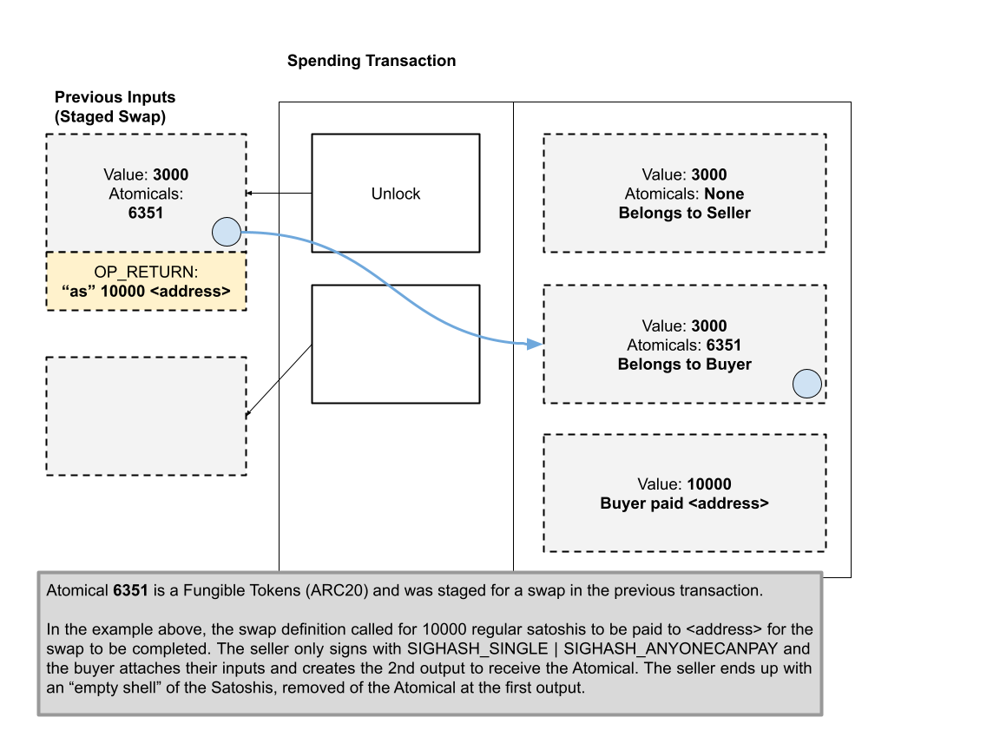

### DeFi Systems and NFT Passports

Concurrent with infrastructure development, we will deploy:

- **DeFi Platforms**: Introduce decentralized exchanges (DEX), cross-chain functionalities, stablecoins, liquidity provisions, and yield aggregation.
  - DEX: [Doc ref](https://docs.atomicals.xyz/arc20-tokens/swap-transfer-rules)
    - In development, en route.
    - We use the atomic swap rules of the Atomic protocol here to trade any token.
     > An Atomical Swap can take place between any ARC20, NFT or regular Satoshis.  
  For example, the following direct transfers are possible, it is up to the seller to define how they would like to receive payment and in what other Atomical token type (if any) 
    Possible direct swaps: 
    ARC20  <--> Satoshis 
    ARC20  <--> ARC20 
    ARC20  <--> NFT 
    NFT       <--> Satoshis 
    NFT       <--> NFT 
    NFT       <--> ARC20 

   - Stablecoins, introducing Ethereum ecosystem liquidity, PoS (Proof of Stake) rewards and U.S. Treasury yields, permissionless access to migrate Ethereum ecosystem liquidity.
   - The Consync ecosystem is set to introduce an **ecological token** (XXX, to be determined), which will serve as the central medium for value storage and transfer in DeFi activities on the Bitcoin network.
    - Consider an order book DEX, utilizing Partially Signed Bitcoin Transactions (PSBTs) as the foundation for trading pairs. The ecosystem token entitles holders to a share of DEX revenues, guiding liquidity into the platform. This structure acts as a carrier for stablecoin liquidity, distributing profits from Ethereum or other PoS ecosystems, including yields from government bonds.