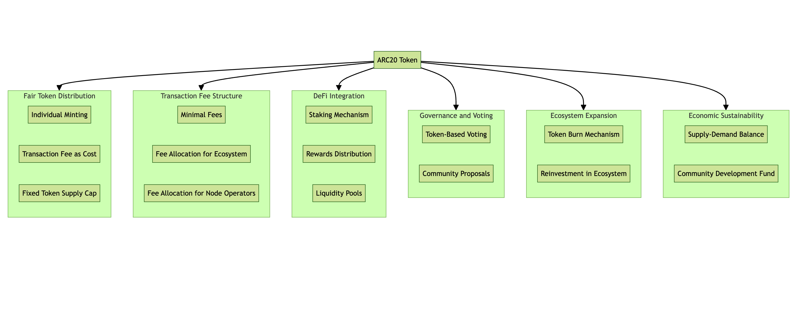

### Fee Structure
#### Usage Fees
- Minimal Fees: Transaction fees are kept minimal to encourage active participation and usage of ARC20 tokens within the ecosystem.
Fee Allocation: A portion of the transaction fees is allocated to ecosystem development and maintenance.
### Incentives for Node Operators
- Fee Redistribution: A percentage of transaction fees is distributed to Atomicals protocol node operators as an incentive for maintaining Atomicals accessibility.
### DeFi Integration
#### Staking and Rewards
- Staking Mechanism: ARC20 token holders can stake their tokens to participate in network governance and earn rewards.
- Reward Distribution: Rewards are distributed based on the staked amount and duration, promoting long-term holding and stability.
#### Liquidity Provision
- Liquidity Pools: Creation of liquidity pools within the ConSync DeFi platforms to facilitate token swaps and other DeFi activities.
- Incentives for Liquidity Providers: Offering rewards to users who provide liquidity, thus ensuring adequate liquidity within the ecosystem.
### Ecosystem Expansion and Token Burn
#### Token Burn Mechanism
- Periodic Token Burns: Implementing a mechanism to burn a portion of the tokens, potentially from transaction fees, to reduce the overall supply and increase scarcity over time.
#### Ecosystem Growth
- Reinvestment in Ecosystem: A portion of the transaction fees is reinvested into the ecosystem for continuous development, marketing, and community building activities.
### Economic Sustainability
#### Long-term Value Stabilization
- Supply and Demand Balance: Careful monitoring and adjustments to ensure a healthy balance between token supply and demand, fostering long-term economic sustainability.
#### Community Development Fund
- Funding Innovations: Establishing a fund to support innovative projects within the ConSync ecosystem, fostering growth and diversification of use cases.
### Conclusion
The economic model for the ConSync ecosystem is designed to be inclusive, sustainable, and growth-oriented, ensuring long-term value for participants.  
By leveraging the Atomicals Protocol and focusing on fair distribution, minimal transaction fees, robust DeFi integration, decentralized governance, and strategic token burns, ConSync is poised to establish a new paradigm in the digital asset economy.
