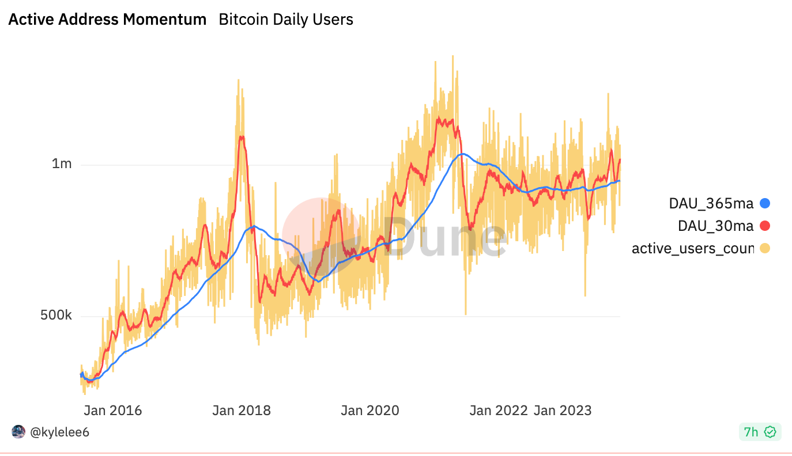

### The Rise of Ordinals
The launch of the NFT protocol "Ordinals" in December 2022 by software engineer Casey Rodarmor, and its subsequent upgrade in January 2023, introduced NFTs to the Bitcoin network without changing the underlying protocol. This innovation allowed for native Bitcoin NFTs, compatible with the network and not reliant on secondary layers, marking a significant step forward for the Bitcoin ecosystem.
